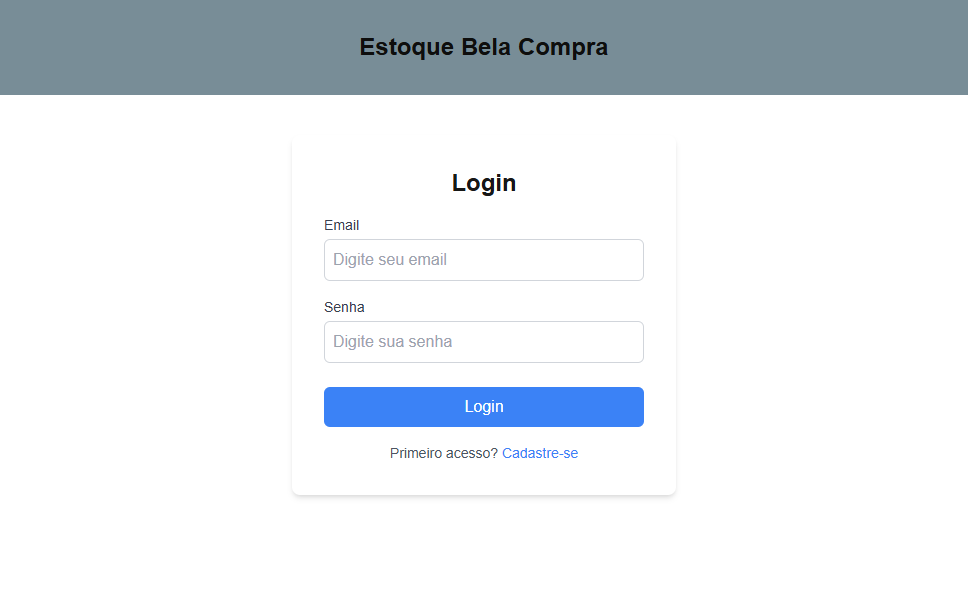
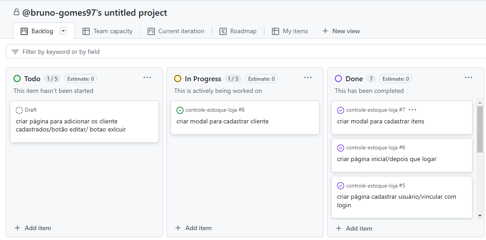

# Controle de Estoque - Bela Compra

Este é um sistema de controle de estoque para a empresa **Bela Compra**. A plataforma permite que funcionários gerenciem o cadastro de produtos e clientes de forma simples e eficiente.

## Funcionalidades

### Página de Login

- O sistema começa com uma página de login onde o funcionário deve inserir suas credenciais.
- Caso o funcionário não tenha cadastro, ele pode se registrar clicando em um link de cadastro.
- Se o funcionário já tiver cadastro, basta fazer o login para acessar a tela inicial.

### Tela Inicial

A tela inicial é composta por:

- **Botões de Cadastro**: Dois botões para acessar modais de cadastro:
  - **Cadastrar Produto**: Abre um modal para cadastrar novos itens no estoque.
  - **Cadastrar Cliente**: Abre outro modal para cadastrar novos clientes.
  
- **Lista de Produtos**: Exibição dinâmica da lista de produtos cadastrados. A lista será atualizada automaticamente conforme novos itens forem cadastrados.

## Fluxo de Uso

1. **Login/Cadastro**: O funcionário acessa a página inicial e faz login com suas credenciais. Caso não tenha um cadastro, ele pode realizar o registro.
2. **Tela Inicial**: Após o login, o funcionário é redirecionado à tela inicial.
    - Ao clicar em **Cadastrar Produto**, um modal é aberto para que o funcionário possa inserir as informações do produto, como nome, quantidade, preço, etc.
    - Ao clicar em **Cadastrar Cliente**, um modal é aberto para registrar os dados do cliente, como nome, e-mail, telefone, etc.
3. **Gestão de Estoque**: A lista de produtos cadastrados é exibida na tela inicial, permitindo o monitoramento em tempo real do estoque da empresa.

## Tecnologias Usadas

- **Frontend**: HTML, CSS, JavaScript

